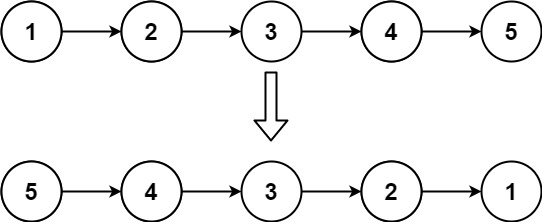

# LeetCode problem 206
Reversing a Linked List - Iterative and Recursive

## Given
A singly linked list was given and we had to reverse it iteratively and recursively.


Definition for singly-linked list.

```cpp
  struct ListNode {
     int val;
     ListNode *next;
      ListNode() : val(0), next(nullptr) {}
      ListNode(int x) : val(x), next(nullptr) {}
      ListNode(int x, ListNode *next) : val(x), next(next) {}
  };
```

# Approach

1. Function Signature: The reverseList method is a member function of the Solution class, which means it can be called using an instance of the Solution class. It takes a single argument, a pointer to a ListNode representing the head of the linked list. The function returns a pointer to a ListNode, which represents the new head of the reversed list.

2. Edge Case Handling: The function starts with some edge case handling. If the input head is NULL or if it is the only node in the list (i.e., head->next is NULL), there is no need to reverse the list, so the function simply returns the head as it is.

3. Pointer Variables: The function declares two pointer variables, prev and forward, both initially set to NULL. These pointers will be used to reverse the linked list iteratively.

4. Reversing the List Iteratively: The core logic of reversing the linked list is done using a while loop. Here's what happens inside the loop:

  a. forward = head->next;: This line stores a pointer to the next node in the forward variable. This is done to prevent losing the rest of the list during the reversal.

  b. head->next = prev;: This line changes the next pointer of the current head node to point to the previous node (prev). This effectively reverses the direction of the edge for the current node.

  c. prev = head;: This line updates the prev pointer to the current head node, so it can be used as the previous node in the next iteration.

  d. head = forward;: This line updates the head pointer to the forward node, which is the next node in the original list. This allows the loop to continue until the entire list is reversed.

5. Memory Cleanup: After the loop finishes, the forward pointer will be NULL because it has moved through the entire list. The code attempts to free this memory using free(forward);. However, this is not necessary and might lead to a runtime error if forward was not allocated using malloc or new. Since forward is just a temporary pointer and does not represent dynamically allocated memory in this context, it's best to remove this line.

6. Return the New Head: Finally, the function returns the prev pointer, which now points to the new head of the reversed list.


Example: <br/><br/>
